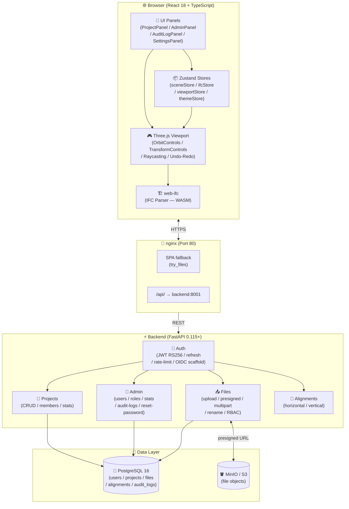
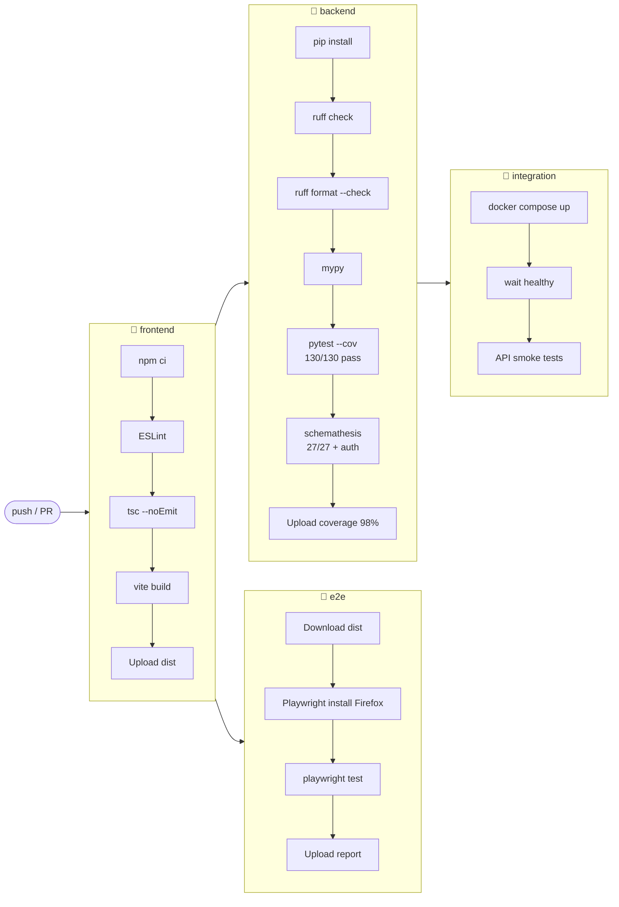
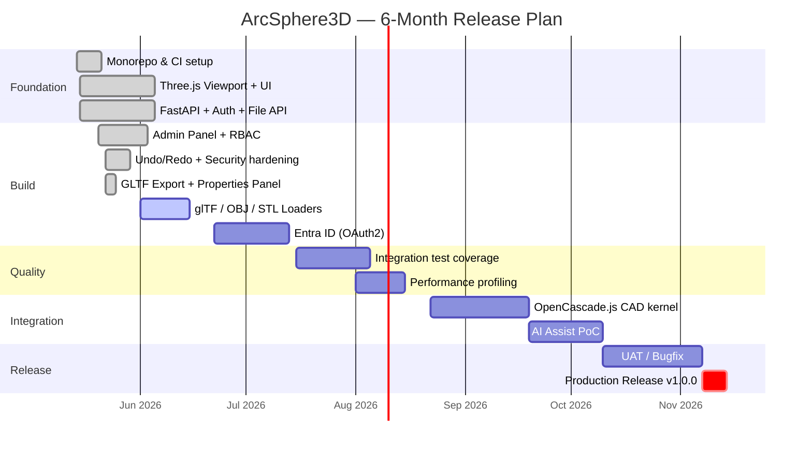

# ArcSphere3D

> **AI Native Web 3D CAD Platform** — フルブラウザ型 3D CAD / BIM / Digital Twin。JWT 認証 + S3 ストレージ + 管理者パネル + Undo/Redo + GLTF エクスポート + プロパティ編集 完備。

[](https://github.com/Kensan196948G/ArcSphere3D/actions/workflows/ci.yml)
[]()
[]()
[]()
[]()
[]()

---

## 🌐 Overview

ArcSphere3D は **AI Native** なブラウザ完結型 3D CAD プラットフォームです。建築・製造・土木エンジニアリングのワークフローを想定して設計されており、プラグイン不要でブラウザから即時利用できます。

- **3D エンジン**: Three.js r169 (OrbitControls / TransformControls / raycasting)
- **BIM/IFC**: web-ifc (WASM, クライアントサイドで IFC 解析)
- **認証**: JWT RS256 非対称鍵 + DB ベースユーザー管理
- **ストレージ**: S3 互換 (MinIO) + sha256 重複排除
- **管理者機能**: ユーザー管理 / ロール変更 / パスワードリセット / 監査ログ
- **インフラ**: Docker Compose (backend + frontend nginx + PostgreSQL + MinIO)

---

## ✅ Feature Status

| #   | 機能                                                                              | ステータス     |
| --- | --------------------------------------------------------------------------------- | -------------- |
| 1   | 🔐 JWT 認証 (RS256 非対称鍵ペア)                                                  | ✅ Done        |
| 2   | 📁 プロジェクト管理 CRUD                                                          | ✅ Done        |
| 3   | 📤 ファイルアップロード — S3 presigned + sha256 重複排除                          | ✅ Done        |
| 4   | 🏗️ IFC 3D ビューア (web-ifc, クライアント WASM)                                   | ✅ Done        |
| 5   | 🎮 Three.js ビューポート — Grid / Axes / TransformControls                        | ✅ Done        |
| 6   | 🌙 ライト / ダークテーマ                                                          | ✅ Done        |
| 7   | 🗺️ GIS バックグラウンドマップ (MapLibre GL JS)                                    | ✅ Done        |
| 8   | ☁️ 点群ビューア (LAS/LAZ, カラーモード)                                           | ✅ Done        |
| 9   | 🏔️ 地形 TIN サーフェス (Delaunay 三角分割)                                        | ✅ Done        |
| 10  | 🏗️ 土工量計算 (切土/盛土ボリューム)                                               | ✅ Done        |
| 11  | 📐 平面線形 (IP 法, CRUD + 3D ライン)                                             | ✅ Done        |
| 12  | 📏 縦断線形 (VIP 法, プロファイルビュー + バックエンド API)                       | ✅ Done        |
| 13  | 🔭 クリック選択 + emissive ハイライト (レイキャスティング)                        | ✅ Done        |
| 14  | 🔑 JWKS エンドポイント (RFC 7517) — 公開鍵ディスカバリー                          | ✅ Done        |
| 15  | 📊 OpenAPI コントラクトテスト (schemathesis, 27/27 pass + auth)                   | ✅ Done        |
| 16  | 🐳 Docker Compose 統合テストスタック                                              | ✅ Done        |
| 17  | 📋 Alembic DB マイグレーション (0001→0006)                                        | ✅ Done        |
| 18  | 🏥 /readyz DB 接続プローブ                                                        | ✅ Done        |
| 19  | 🧪 E2E テスト — Playwright / Firefox (120+ pass)                                  | ✅ Done        |
| 20  | 👥 RBAC — メンバーアクセス制御 (owner/editor/viewer per project)                  | ✅ Done        |
| 21  | 🔒 レートリミット — ログインブルートフォース対策 (5 req/60s)                      | ✅ Done        |
| 22  | 👥 マルチオーナーモデル + 最終オーナー保護 (Issue #66)                            | ✅ Done        |
| 23  | 📐 CAD パネル — Three.js プリミティブ形状 (Box/Sphere/Cyl/…)                     | ✅ Done        |
| 24  | 👥 MembersPanel UI — メール検索でメンバー追加/削除 (Issue #71)                    | ✅ Done        |
| 25  | 🗑️ プロジェクト削除 UI — owner がプロジェクトを削除                               | ✅ Done        |
| 26  | ✏️ プロジェクト名変更 UI — owner/editor がプロジェクト名変更                      | ✅ Done        |
| 27  | 🔍 ユーザー検索 API — `GET /api/users/lookup?email=`                              | ✅ Done        |
| 28  | 📧 MembersPanel UX — email 表示 + バリデーション + editor/viewer 閲覧             | ✅ Done        |
| 29  | 📐 Alignment 3D レンダラー — IP 点クリック選択・3D ビュー連携                    | ✅ Done        |
| 30  | 📂 FileLoader E2E — STL/GLB/STEP/IGES アップロードテスト                          | ✅ Done        |
| 31  | 🔐 Files API RBAC — viewer/editor/non-member アクセス制御テスト                   | ✅ Done        |
| 32  | 🔐 Alignments/Verticals RBAC — GET/DELETE/IP 点置換テスト                         | ✅ Done        |
| 33  | 🖱️ ログイン失敗フィードバック E2E テスト                                          | ✅ Done        |
| 34  | 🗂️ LayerPanel 可視性切替・削除 E2E テスト                                         | ✅ Done        |
| 35  | 🎯 Viewport ドラッグ&ドロップ + useFileProcessor フック                           | ✅ Done        |
| 36  | 🎬 カメラプリセットビュー — 平面図/正面/側面/3D                                   | ✅ Done        |
| 37  | ⌨️ Delete/Backspace キーで選択オブジェクト削除                                    | ✅ Done        |
| 38  | 📊 GET /api/projects/{id}/stats — 統計 API                                        | ✅ Done        |
| 39  | 📊 ProjectPanel 統計バッジ表示                                                    | ✅ Done        |
| 40  | ✏️ PATCH /api/files/{id} — ファイル名変更 API + `renameFile()` (Issue #166)       | ✅ Done        |
| 41  | 📷 Viewport スクリーンショット保存 (PNG)                                          | ✅ Done        |
| 42  | 📋 コンソールログ保存 + 計測クリップボードコピー                                  | ✅ Done        |
| 43  | 🗑️ シーン全削除ボタン + clearScene                                                | ✅ Done        |
| 44  | 🗺️ Grid/Axes トグル + Grid カラーピッカー                                         | ✅ Done        |
| 45  | ⌨️ ショートカットヘルプ Overlay                                                    | ✅ Done        |
| 46  | 🔎 Scene Tree フィルタ検索                                                        | ✅ Done        |
| 47  | 👤 Header にログインユーザー email 表示                                           | ✅ Done        |
| 48  | 🎛️ Object opacity スライダー                                                      | ✅ Done        |
| 49  | 🎬 ダブルクリックで選択オブジェクトにカメラフォーカス                             | ✅ Done        |
| 50  | 💾 コンソールログを `.log` ファイルとして export                                   | ✅ Done        |
| 51  | 🧪 Backend TDD coverage 強化 (ratelimit / S3)                                     | ✅ Done        |
| 52  | 📋 監査ログ — audit_logs テーブル + append-only 記録                              | ✅ Done        |
| 53  | 🔐 本番認証基盤 — DB ユーザー管理 + Entra ID OIDC scaffold                        | ✅ Done        |
| 54  | 📤 マルチパート / resumable アップロード — 大容量 BIM/CAD                         | ✅ Done        |
| 55  | 🐳 Docker Compose 実環境 E2E — API 結合 + Playwright                              | ✅ Done        |
| 56  | 🎨 マルチパート UI — 10 MiB チャンク進捗バー + キャンセル                         | ✅ Done        |
| 57  | 🛡️ 監査ログ閲覧パネル — 管理者向け UI                                             | ✅ Done        |
| 58  | 🔑 パスワード変更 API — POST /api/auth/password                                   | ✅ Done        |
| 59  | 👤 管理者ユーザー管理 API — GET/DELETE /api/admin/users                           | ✅ Done        |
| 60  | 📊 管理ダッシュボード統計ウィジェット — AuditLogPanel に stats カード             | ✅ Done        |
| 61  | 🧪 パスワード変更・監査ログ API 実環境統合テスト                                  | ✅ Done        |
| 62  | 👤 管理者ユーザー作成 — POST /api/admin/users                                     | ✅ Done        |
| 63  | 🔢 マルチパートアップロード E2E テスト                                            | ✅ Done        |
| 64  | 📊 管理ダッシュボード統計 API — GET /api/admin/stats                              | ✅ Done        |
| 65  | 🔑 ユーザーロール変更 — PATCH /api/admin/users/{id}/role                          | ✅ Done        |
| 66  | ⚙️ 設定パネル パスワード変更フォーム                                              | ✅ Done        |
| 67  | 👤 管理者ユーザー管理パネル — AdminPanel タブ UI                                  | ✅ Done        |
| 68  | 🔔 グローバル Toast 通知システム                                                  | ✅ Done        |
| 69  | 🔐 管理者パスワードリセット — POST /api/admin/users/{id}/reset-password (Issue #156) | ✅ Done     |
| 70  | ↩️ Undo / Redo — Command Pattern (sceneStore, Issue #162)                         | ✅ Done        |
| 71  | 🎛️ AdminUsersPanel ロール変更 + パスワードリセット UI (Issue #164)                | ✅ Done        |
| 72  | 🔒 JWT refresh でロールを DB から再取得 (Issue #165, 対抗レビュー済)              | ✅ Done        |
| 73  | ✏️ renameFile() フロントエンド関数 + PATCH /api/files/{id} (Issue #166)           | ✅ Done        |
| 74  | 🐳 docker-compose frontend nginx サービス追加 (Issue #167)                        | ✅ Done        |
| 75  | 📤 シーン GLTF (.glb) エクスポート — ViewportToolbar (Issue #175)                  | ✅ Done        |
| 76  | 🎛️ オブジェクトプロパティパネル — 位置/回転/拡縮の数値入力 (Issue #176)           | ✅ Done        |
| 77  | 📚 README 大幅刷新 — 表・アイコン・Mermaid ダイアグラム (Issue #168)               | ✅ Done        |
| 78  | 🔑 JWT subject に immutable user.id を使う (Issue #180, PR #183)                  | ✅ Done        |
| 79  | 🖱️ ProjectPanel ファイルリネーム UI (Issue #174, PR #182)                         | ✅ Done        |
| 80  | 👤 AdminUsersPanel 新規ユーザー作成フォーム (Issue #188, PR #190)                 | ✅ Done        |
| 81  | ⬇️ ProjectPanel ファイルダウンロードボタン (Issue #189, PR #190)                  | ✅ Done        |
| 82  | 🔍 ProjectPanel プロジェクト検索フィルター                                        | ✅ Done        |
| 83  | 📏 ファイルサイズ表示 (B/KB/MB)                                                   | ✅ Done        |
| 84  | 🔍 AdminUsersPanel ユーザー検索フィルター                                          | ✅ Done        |
| 85  | 📐 OpenCascade.js STEP/IGES CAD kernel integration (Issue #75)                    | 🚧 WIP         |
| 86  | 🌐 リアルタイムコラボレーション (WebSocket)                                       | 🔮 Planned     |
| 87  | 🤖 AI アシスト CAD コマンド                                                       | 🔮 Planned     |

> 凡例: ✅ **Done** = main にマージ済 / 🚧 **WIP** = 実装またはレビュー進行中 / 🔮 **Planned** = ロードマップ計画中

---

## 🆕 直近のリリース (Session 2026-05-23)

| PR    | コミット   | 内容                                                                           | 種別        |
| ----- | ---------- | ------------------------------------------------------------------------------ | ----------- |
| #182  | `0916857`  | 🖱️ ProjectPanel ファイルリネーム UI — inline 編集 (Issue #174)                 | 🖼️ UI       |
| #183  | `e5f4068`  | 🔑 JWT subject = immutable user.id UUID (Issue #180, セキュリティ強化)         | 🛡️ Security |
| #184  | `13a0dab`  | 📦 minor/patch deps bump (frontend)                                            | 🔧 Chore    |
| #190  | WIP        | 👤 AdminUsersPanel 新規ユーザー作成フォーム (Issue #188)                       | 🖼️ UI       |
| #190  | WIP        | ⬇️ ProjectPanel ファイルダウンロードボタン (Issue #189)                        | 🖼️ UI       |
| —     | `a250716`  | 🔍 ProjectPanel プロジェクト検索フィルター + 📏 ファイルサイズ表示             | 🖼️ UI       |
| —     | `61cd225`  | 🔍 AdminUsersPanel ユーザー検索フィルター                                      | 🖼️ UI       |

> 🛡️ **Security ハイライト (PR #183)**: JWT `sub` を mutable な email から immutable な `user.id` (UUID) に変更。email 変更後も既存トークンが有効になり、audit log の追跡性が向上。`refresh` エンドポイントも DB から user.id で再取得するよう更新。

---

### 📋 過去のリリース (Session 2026-05-22)

| PR    | コミット   | 内容                                                                | 種別        |
| ----- | ---------- | ------------------------------------------------------------------- | ----------- |
| #163  | `a40a507`  | ↩️ Ctrl+Z / Ctrl+Y で Undo / Redo — シーン操作履歴 (Issue #162)     | ⚙️ Feature  |
| #169  | `94e250e`  | ✏️ PATCH /api/files/{id} ファイル名変更 API (Issue #166)            | ⚙️ Backend  |
| #170  | `69d6cd1`  | 🎛️ AdminUsersPanel ロール変更・パスワードリセット UI (Issue #164)   | 🖼️ UI       |
| #171  | `7593b95`  | 🐳 docker-compose にフロントエンド nginx サービスを追加 (Issue #167) | 🛠️ Infra    |
| #172  | `da0c91b`  | 🔒 JWT refresh でロールを DB から再取得 (Issue #165, 対抗レビュー)   | 🛡️ Security |
| #177  | `e9ceb76`  | 📤 シーン GLTF (.glb) エクスポートボタン (Issue #175)               | ⚙️ Feature  |
| #178  | `40142e6`  | 🎛️ オブジェクトプロパティパネル — 位置/回転/拡縮 (Issue #176)       | 🖼️ UI       |

---

## 🏗️ Architecture



---

## 🛠️ Tech Stack

| レイヤー               | 技術                                                                  |
| ---------------------- | --------------------------------------------------------------------- |
| **フロントエンド FW**  | React 18, TypeScript                                                  |
| **3D レンダリング**    | Three.js r169 (OrbitControls, TransformControls, GridHelper)          |
| **BIM / IFC**          | web-ifc (WASM, クライアントサイド)                                    |
| **バンドラー**         | Vite 6 — esbuild minify, manual chunks (vendor-three / vendor-react)  |
| **スタイリング**       | Tailwind CSS                                                          |
| **状態管理**           | Zustand (sceneStore / ifcStore / viewportStore / themeStore)          |
| **E2E テスト**         | Playwright (Firefox, xvfb-run)                                        |
| **バックエンド FW**    | FastAPI 0.115+                                                        |
| **ORM / マイグレーション** | SQLAlchemy 2, Alembic                                             |
| **DB ドライバー**      | psycopg3 (psycopg[binary])                                            |
| **認証**               | python-jose RS256, bcrypt 4.x                                         |
| **オブジェクトストレージ** | boto3 + MinIO (S3 互換)                                           |
| **ロギング**           | structlog (structured JSON)                                           |
| **Lint / 型チェック**  | Ruff, mypy, ESLint 9 flat config                                      |
| **データベース**       | PostgreSQL 16                                                         |
| **ローカルインフラ**   | Docker Compose (backend / frontend-nginx / postgres / minio)          |
| **CI**                 | GitHub Actions                                                        |

---

## 🔌 API Endpoints

### 🔐 Auth

| Method   | Path                                        | 説明                                              |
| -------- | ------------------------------------------- | ------------------------------------------------- |
| `POST`   | `/api/auth/login`                           | JWT アクセストークン取得 (RS256)                  |
| `POST`   | `/api/auth/refresh`                         | アクセストークン更新 — DB からロール再取得        |
| `POST`   | `/api/auth/logout`                          | ログアウト (クライアント側トークン破棄)           |
| `POST`   | `/api/auth/password`                        | パスワード変更 (認証済みユーザー)                 |
| `GET`    | `/api/auth/.well-known/jwks.json`           | JWKS — RSA 公開鍵 (RFC 7517)                      |
| `GET`    | `/api/auth/oidc/callback`                   | Entra ID OIDC callback scaffold (post-MVP)        |

### 👤 Users

| Method | Path                            | 説明                                          |
| ------ | ------------------------------- | --------------------------------------------- |
| `GET`  | `/api/users/me`                 | 認証中ユーザー情報 (DB UUID)                  |
| `GET`  | `/api/users/lookup?email=`      | メールアドレスでユーザー検索                  |

### 📁 Projects

| Method   | Path                                                       | 説明                                     |
| -------- | ---------------------------------------------------------- | ---------------------------------------- |
| `GET`    | `/api/projects`                                            | プロジェクト一覧 (ページネーション)      |
| `POST`   | `/api/projects`                                            | プロジェクト作成                         |
| `GET`    | `/api/projects/{id}`                                       | プロジェクト詳細                         |
| `PUT`    | `/api/projects/{id}`                                       | プロジェクト名変更 (owner/editor)        |
| `DELETE` | `/api/projects/{id}`                                       | プロジェクト削除 (owner のみ)            |
| `GET`    | `/api/projects/{id}/stats`                                 | プロジェクト統計                         |
| `GET`    | `/api/projects/{id}/members`                               | メンバー一覧                             |
| `POST`   | `/api/projects/{id}/members`                               | メンバー追加/ロール更新 (owner のみ)     |
| `DELETE` | `/api/projects/{id}/members/{uid}`                         | メンバー除名 (owner のみ)                |

### 📤 Files

| Method   | Path                                    | 説明                                    |
| -------- | --------------------------------------- | --------------------------------------- |
| `GET`    | `/api/projects/{id}/files`              | ファイル一覧 (ページネーション)         |
| `POST`   | `/api/projects/{id}/files`              | ファイルアップロード (presigned + dedup) |
| `GET`    | `/api/projects/{id}/files/{fid}/download` | presigned ダウンロード URL 発行       |
| `DELETE` | `/api/projects/{id}/files/{fid}`        | ファイル削除                            |
| `PATCH`  | `/api/files/{id}`                       | ファイル名変更                          |
| `POST`   | `/api/files/multipart/init`             | マルチパートアップロード開始            |
| `POST`   | `/api/files/multipart/complete`         | マルチパートアップロード完了            |
| `POST`   | `/api/files/multipart/abort`            | マルチパートアップロード中断            |

### 📐 Alignments

| Method   | Path                                                            | 説明                           |
| -------- | --------------------------------------------------------------- | ------------------------------ |
| `GET`    | `/api/projects/{id}/alignments`                                 | 平面線形一覧                   |
| `POST`   | `/api/projects/{id}/alignments`                                 | 平面線形作成                   |
| `GET`    | `/api/projects/{id}/alignments/{aid}`                           | 平面線形詳細                   |
| `DELETE` | `/api/projects/{id}/alignments/{aid}`                           | 平面線形削除                   |
| `PUT`    | `/api/projects/{id}/alignments/{aid}/ip-points`                 | IP 点一括置換 (idempotent)     |
| `GET`    | `/api/projects/{id}/alignments/{aid}/verticals`                 | 縦断線形一覧                   |
| `POST`   | `/api/projects/{id}/alignments/{aid}/verticals`                 | 縦断線形作成                   |
| `GET`    | `/api/projects/{id}/alignments/{aid}/verticals/{vid}`           | 縦断線形詳細                   |
| `DELETE` | `/api/projects/{id}/alignments/{aid}/verticals/{vid}`           | 縦断線形削除                   |
| `PUT`    | `/api/projects/{id}/alignments/{aid}/verticals/{vid}/vips`      | VIP 一括置換 (idempotent)      |

### 👑 Admin (admin ロール限定)

| Method   | Path                                        | 説明                                              |
| -------- | ------------------------------------------- | ------------------------------------------------- |
| `GET`    | `/api/admin/users`                          | ユーザー一覧                                      |
| `POST`   | `/api/admin/users`                          | ユーザー作成                                      |
| `DELETE` | `/api/admin/users/{user_id}`                | ユーザー削除 (自己削除禁止)                       |
| `PATCH`  | `/api/admin/users/{user_id}/role`           | ユーザーロール変更 (自己降格禁止)                 |
| `POST`   | `/api/admin/users/{user_id}/reset-password` | ユーザーパスワード強制リセット                    |
| `GET`    | `/api/admin/stats`                          | ダッシュボード統計 (users/projects/files/events)  |
| `GET`    | `/api/admin/audit-logs`                     | 監査ログ一覧 (action / resource_type フィルタ)    |

### 🏥 Health

| Method | Path       | 説明                          |
| ------ | ---------- | ----------------------------- |
| `GET`  | `/healthz` | 生存プローブ (常時 200)       |
| `GET`  | `/readyz`  | 準備プローブ (DB 接続確認)    |

> インタラクティブ API ドキュメント: `http://localhost:8001/docs` (Swagger UI)

---

## ⚙️ CI Pipeline



---

## 🚀 Quick Start

前提: **Docker 24+** と **Docker Compose v2** (推奨)、または Node.js 20+ / Python 3.12+。

```bash
# リポジトリをクローン
git clone https://github.com/Kensan196948G/ArcSphere3D.git
cd ArcSphere3D

# フルスタック起動 (API + DB + MinIO + Frontend nginx)
docker compose -f docker/docker-compose.yml up --build
```

| サービス              | URL                         |
| --------------------- | --------------------------- |
| フロントエンド (nginx) | http://localhost            |
| Backend API           | http://localhost:8001       |
| API Docs (Swagger)    | http://localhost:8001/docs  |
| MinIO Console         | http://localhost:9001       |

**手動セットアップ (Docker なし)**

```bash
# フロントエンド
cd frontend
npm install
npm run dev          # http://localhost:5175

# バックエンド (別ターミナル)
cd backend
python -m venv .venv && source .venv/bin/activate
pip install -e ".[dev]"
uvicorn app.main:app --reload --port 8001
```

**E2E テスト実行**

```bash
cd frontend
npx playwright install --with-deps firefox
npx playwright test
```

**バックエンドテスト実行**

```bash
cd backend
pytest -q --cov=app
```

---

## 📅 Development Roadmap



| フェーズ              | 期間                    | 主要マイルストーン                                                    |
| --------------------- | ----------------------- | --------------------------------------------------------------------- |
| **M1** May 2026       | Foundation              | Monorepo, CI, Three.js ビューポート, FastAPI スケルトン, JWT 認証     |
| **M2** Jun 2026       | Build                   | 管理者パネル, Undo/Redo, glTF/OBJ/STL ローダー, Entra ID OAuth2       |
| **M3** Jul 2026       | Quality                 | セキュリティ監査, 統合テストカバレッジ, パフォーマンスプロファイリング |
| **M4** Aug 2026       | Integration             | OpenCascade.js CAD kernel, IFC 高度機能                               |
| **M5** Sep 2026       | Integration             | AI アシスト PoC, WebSocket コラボレーションプロトタイプ               |
| **M6** Oct–Nov 2026   | Release                 | UAT, バグ修正, CHANGELOG, **v1.0.0 リリース 2026-11-14**             |

---

## 🔒 Security

ArcSphere3D は認証・認可・トランスポートにわたる多層防御を適用しています。

| レイヤー                   | 機能                                                                     | 標準 / 参考                           |
| -------------------------- | ------------------------------------------------------------------------ | ------------------------------------- |
| **認証**                   | JWT RS256 非対称鍵 — 短命トークン、DB に保存しない                       | RFC 7519, RFC 7517 (JWKS)             |
| **ロール同期**             | リフレッシュ時に DB からロール再取得 — 古いロールが残存しない            | Issue #165                            |
| **ブルートフォース対策**   | 1 IP あたり 5 req/60s のスライディングウィンドウ制限                     | RFC 7231 §7.1.3 (429 + Retry-After)   |
| **認可**                   | プロジェクト単位 RBAC — `owner / editor / viewer` を API レイヤーで強制  | OWASP Access Control                  |
| **管理者機能 RBAC**        | グローバルロール `admin` による ユーザー管理・監査ログアクセス            | —                                     |
| **パスワード保管**         | bcrypt 4.x + per-user salt — 平文・MD5/SHA1 なし                         | OWASP Password Storage                |
| **トランスポート**         | 本番環境 HTTPS のみ；HSTS はリバースプロキシ層で推奨                     | OWASP TLS Cheat Sheet                 |
| **ファイル整合性**         | アップロード時 SHA-256 重複排除 — 改ざん検出可能                         | —                                     |

### 🛡️ レートリミット

ログインエンドポイント (`POST /api/auth/login`) は IP 別スライディングウィンドウで保護:

```
最大試行回数 : 5
ウィンドウ   : 60 秒
レスポンス   : HTTP 429 + Retry-After: 60
リセット     : ウィンドウ有効期限後に自動
```

Redis 等の外部サービス不要で、クレデンシャルスタッフィングとブルートフォース攻撃を防止します。

### 🔐 3 層認可マトリックス (RBAC)

すべてのプロジェクトリソースに**3 段階アクセスモデル**を適用。非メンバーには `404` を返すことでプロジェクト存在リークを防ぐ ([IDOR](https://owasp.org/www-community/attacks/Insecure_Direct_Object_References) 対策)。

| ロール              | `GET /members`  | `POST /members` | `DELETE /members/{uid}` | `DELETE /projects/{id}` |
| ------------------- | --------------- | --------------- | ----------------------- | ----------------------- |
| 👑 owner            | ✅ `200`        | ✅ `201`        | ✅ `204`                | ✅ `204`                |
| ✏️ editor (member)  | ✅ `200`        | 🚫 `403`        | 🚫 `403`                | 🚫 `403`                |
| 👀 viewer (member)  | ✅ `200`        | 🚫 `403`        | 🚫 `403`                | 🚫 `403`                |
| 🪪 stranger         | ❓ `404`        | ❓ `404`        | ❓ `404`                | ❓ `404`                |

### 👥 マルチオーナーモデル (Issue #66)

プロジェクト作成時に `project_members` へ **owner 行を自動挿入**。
最終オーナー保護: `DELETE /members/{uid}` で唯一のオーナーを除名しようとすると `409 Conflict`。

| シナリオ                                             | 結果                                            |
| ---------------------------------------------------- | ----------------------------------------------- |
| 最後のオーナーを除名                                 | `409 Conflict` — "cannot remove the last owner" |
| 最後ではないオーナーを除名                           | `204 No Content`                                |
| editor / viewer を除名                               | `204 No Content`                                |
| オーナー移譲 (2 人目追加 → 1 人目削除)               | 両操作 `201` / `204`                            |

---

## 🎮 Viewport キーボードショートカット

| キー          | 操作                         |
| ------------- | ---------------------------- |
| `W`           | 移動モード                   |
| `E`           | 回転モード                   |
| `R`           | 拡縮モード                   |
| `F`           | 選択オブジェクトにフォーカス |
| `Esc`         | 選択解除                     |
| `Ctrl+D`      | 選択オブジェクトを複製       |
| `Del / BS`    | 選択オブジェクト削除         |
| `Ctrl+Z`      | 元に戻す (Undo)              |
| `Ctrl+Y`      | やり直す (Redo)              |

---

## License

Proprietary — All rights reserved. Contact the maintainers for licensing inquiries.
