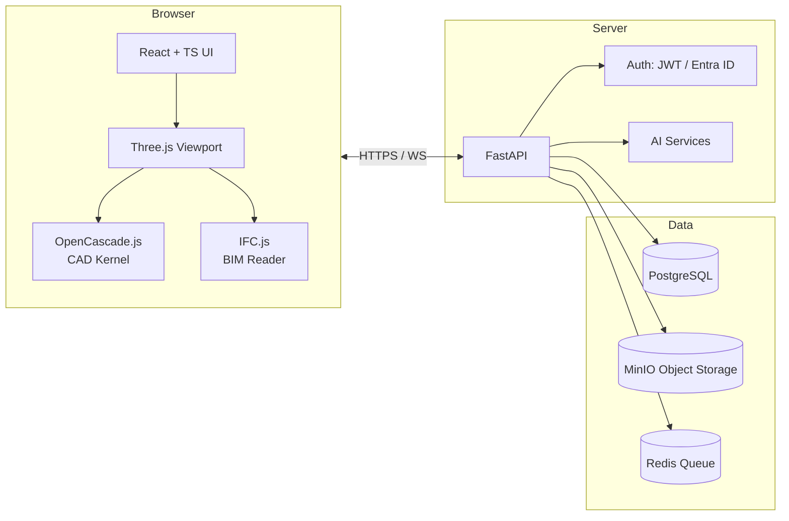
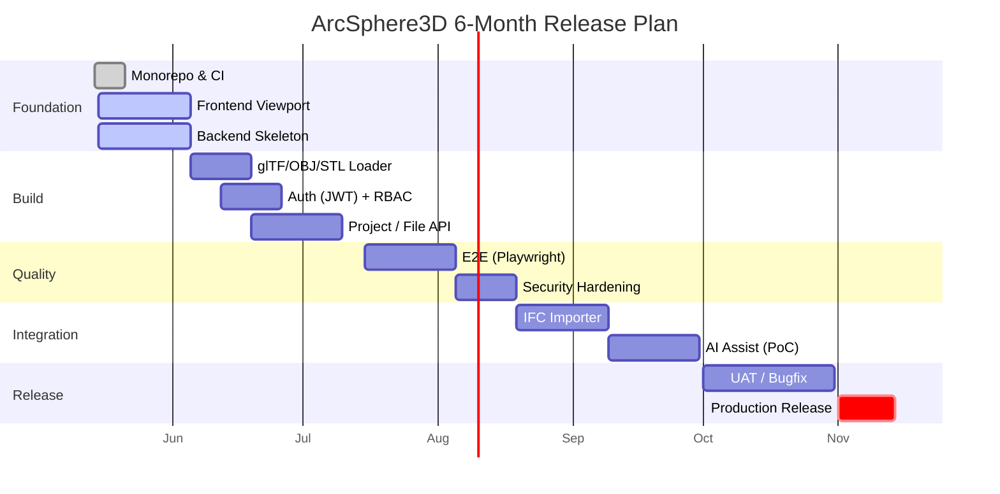

# 🌐 ArcSphere3D

> **AI Native Web 3D CAD Platform** — ブラウザだけで動く、AI が伴走する 3D CAD / BIM / Digital Twin。

| 🟢 Status | 🎯 Goal | 📅 Term | 🏷️ Stage |
|---|---|---|---|
| **Build (MVP)** | MVP Release → Production Release | 2026-05-14 → **2026-11-14** (6 ヶ月) | `mvp-release` |

[]()
[]()
[]()
[]()
[]()

---

## 🧭 What is ArcSphere3D?

ArcSphere3D は **AI Native** な Web 3D CAD プラットフォームです。
建設・製造・設計業務における 3D モデリング、BIM、Digital Twin、コラボレーションを **ブラウザ単体** で実現します。

| 🚧 課題 | ✅ ArcSphere3D の解 |
|---|---|
| 高価な専用 CAD | Web 化による低コスト化 |
| ローカル PC 依存 | フルブラウザ運用 |
| BIM 連携不足 | IFC / BIM 統合 |
| 属人化 | AI 支援 (自然言語 → CAD コマンド) |
| データ分散 | 統合プロジェクト管理 |
| コラボ困難 | リアルタイム共有 / コメント |

---

## 🏗️ Architecture



---

## 🧱 Tech Stack

### 🖥️ Frontend
| 分野 | 技術 |
|---|---|
| Framework | ⚛️ React 18 |
| Language | 🟦 TypeScript |
| Bundler | ⚡ Vite |
| UI | 🎨 TailwindCSS |
| 3D | 🌐 Three.js |
| State | 🐻 Zustand |
| Router | 🧭 React Router |
| CAD Kernel | 🔧 OpenCascade.js (post-MVP) |
| BIM | 🏗️ IFC.js (post-MVP) |

### ⚙️ Backend
| 分野 | 技術 |
|---|---|
| API | 🚀 FastAPI |
| ORM | 🗄️ SQLAlchemy |
| Migration | 🪶 Alembic |
| Auth | 🔐 JWT / OAuth2 / Microsoft Entra ID |
| Queue | 📨 Redis |

### 🗃️ Data & Infra
| 分野 | 技術 |
|---|---|
| RDB | 🐘 PostgreSQL |
| Object Store | 🪣 MinIO |
| Container | 🐳 Docker Compose (MVP) / ☸️ Kubernetes (future) |
| CI / CD | 🧪 GitHub Actions + 🤖 CodeRabbit + 🛠️ Codex Review |

---

## 📁 Directory Layout

```text
ArcSphere3D/
├── frontend/        # ⚛️  React + TS + Three.js (Web 3D Viewport)
├── backend/         # 🚀  FastAPI (REST API, Auth, Project, File)
├── cad-engine/      # 🔧  OpenCascade.js wrappers (post-MVP)
├── bim-engine/      # 🏗️  IFC.js / BIM property tree (post-MVP)
├── ai-services/     # 🤖  AI assist services (post-MVP)
├── infra/           # 🌐  IaC (Terraform / k8s manifests, future)
├── docker/          # 🐳  docker-compose, Dockerfiles
├── docs/            # 📚  ARCHITECTURE / ROADMAP / ADR / SECURITY
├── tests/           # 🧪  Cross-cutting integration / e2e tests
└── .github/         # 🛠️  Workflows, Issue templates
```

---

## 🚦 MVP Scope (本セッション)

| # | 機能 | 状態 |
|---|---|---|
| 1 | 3D Viewport (Three.js + OrbitControls + GridHelper + Light) | 🟡 In Progress |
| 2 | STL / OBJ / glTF Loader | ⚪ Planned |
| 3 | 基本 Transform (Move / Rotate / Scale) | ⚪ Planned |
| 4 | WebUI Layout (Header / LeftMenu / Viewport / RightPanel / Console) | 🟡 In Progress |
| 5 | 認証 (JWT スケルトン; Entra ID は post-MVP) | 🟡 In Progress |

---

## 📅 6-Month Roadmap



| Month | フェーズ | 主要マイルストーン |
|---|---|---|
| **M1** (2026-05) | Foundation | monorepo / CI / Viewport / FastAPI スケルトン |
| **M2** (2026-06) | Build | Loader / Auth / Project API |
| **M3** (2026-07) | Build → Quality | TransformControls / RightPanel / E2E 開始 |
| **M4** (2026-08) | Quality → Integration | Security Audit / IFC PoC |
| **M5** (2026-09) | Integration | AI Assist PoC / UAT 準備 |
| **M6** (2026-10–11) | Release | UAT / Bugfix / **🚀 v1.0.0 リリース 2026-11-14** |

---

## ⚡ Quick Start

> 前提: Node.js 20+ / Python 3.12+ / Docker 24+ / Git 2.40+

```bash
# 1. リポジトリ
git clone <repo> && cd ArcSphere3D

# 2. Frontend
cd frontend && npm install && npm run dev
# → http://localhost:5173

# 3. Backend
cd ../backend && python -m venv .venv && source .venv/bin/activate
pip install -e ".[dev]"
uvicorn app.main:app --reload
# → http://localhost:8000/docs

# 4. (任意) フルスタック起動
docker compose -f docker/docker-compose.yml up --build
```

---

## 🔐 Security Posture

| 項目 | 方針 |
|---|---|
| Transport | HTTPS (本番) / HTTP (dev のみ) |
| Auth | JWT (HS256→RS256 移行予定) / OAuth2 / Entra ID |
| AuthZ | RBAC (`viewer`, `editor`, `admin`) |
| Storage | MinIO Server-Side Encryption |
| Audit | `audit_logs` テーブル + 構造化ログ |
| SAST | CodeQL (GitHub Actions) |
| Dep | Dependabot |

詳細は [`docs/SECURITY.md`](docs/SECURITY.md)。

---

## 🤖 AI-Assisted Development

このプロジェクトは **ClaudeOS** を用いた自律開発で運営されています。

| 役割 | ツール |
|---|---|
| 主実装 | 🟣 Claude Code (Opus 4.7) |
| Code Review | 🟢 CodeRabbit |
| Adversarial Review | 🔵 Codex Review |
| CI/CD | 🛠️ GitHub Actions |
| Project Mgmt | 📋 GitHub Projects |

---

## 📚 Docs

- [`docs/ARCHITECTURE.md`](docs/ARCHITECTURE.md) — システム全体構成と境界
- [`docs/ROADMAP.md`](docs/ROADMAP.md) — 6 ヶ月詳細ロードマップ
- [`docs/SECURITY.md`](docs/SECURITY.md) — セキュリティ方針
- [`docs/adr/`](docs/adr/) — 設計判断記録 (ADR)

---

## 📝 License

Proprietary — All rights reserved (詳細は別途整備)。
