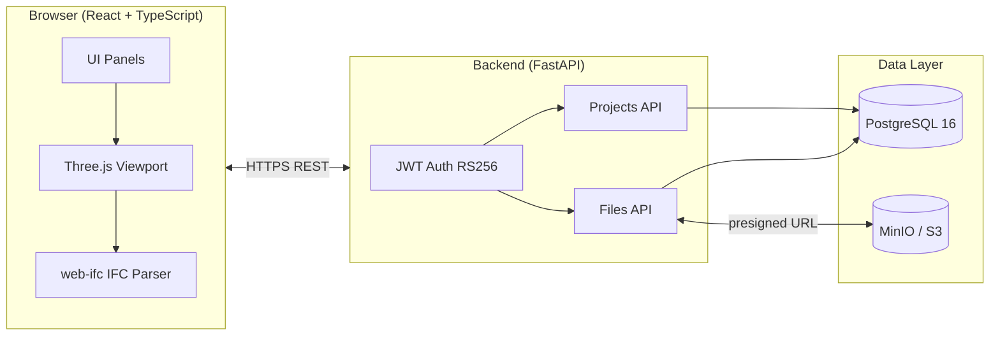
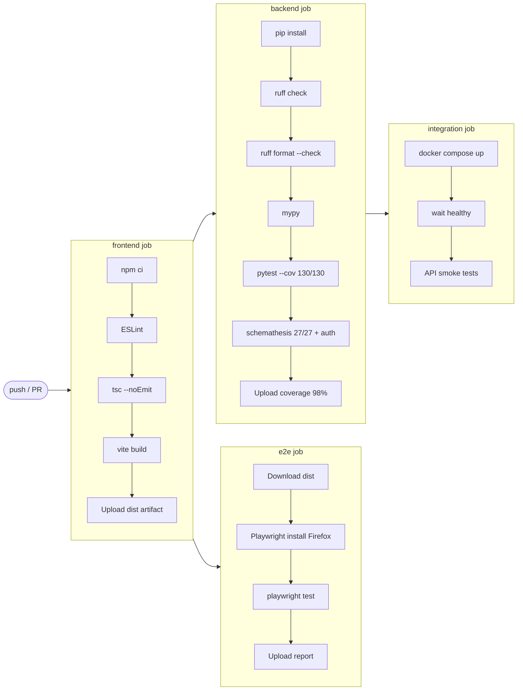

# ArcSphere3D

> **AI Native Web 3D CAD Platform** — Full browser-based 3D CAD / BIM / Digital Twin with JWT authentication and S3-backed file storage.

[](https://github.com/Kensan196948G/ArcSphere3D/actions/workflows/ci.yml)
[]()
[]()
[]()
[]()

---

## Overview

ArcSphere3D is an **AI Native** web-based 3D CAD platform designed for architecture, manufacturing, and engineering workflows. It runs entirely in the browser — no plugins, no local installs — backed by a FastAPI REST API, PostgreSQL, and S3-compatible object storage.

Users authenticate via **JWT (RS256)**, manage 3D projects and files through a structured REST API, and visualize models directly in the browser using a Three.js viewport. IFC (Industry Foundation Classes) files are parsed and rendered client-side via **web-ifc**, enabling BIM workflows without any server-side CAD kernel. The platform is built for collaborative, cloud-first teams who need professional 3D tooling without the overhead of traditional desktop CAD.

---

## Feature Status

| #   | Feature                                                        | Status     |
| --- | -------------------------------------------------------------- | ---------- |
| 1   | 🔐 JWT authentication (RS256 asymmetric keypair)               | ✅ Done    |
| 2   | 📁 Project management CRUD                                     | ✅ Done    |
| 3   | 📤 File upload — S3 presigned + sha256 deduplication           | ✅ Done    |
| 4   | 🏗️ IFC 3D viewer (web-ifc, client-side WASM)                   | ✅ Done    |
| 5   | 🎮 Three.js viewport — Grid / Axes / Transform Controls        | ✅ Done    |
| 6   | 🌙 Light / Dark theme                                          | ✅ Done    |
| 7   | 🗺️ GIS background map (MapLibre GL JS)                         | ✅ Done    |
| 8   | ☁️ Point cloud viewer (LAS/LAZ, color modes)                   | ✅ Done    |
| 9   | 🏔️ Terrain TIN surface (Delaunay triangulation)                | ✅ Done    |
| 10  | 🏗️ Earthwork calculation (cut/fill volumes)                    | ✅ Done    |
| 11  | 📐 Horizontal alignment (IP method, CRUD + 3D line)            | ✅ Done    |
| 12  | 📏 Vertical alignment (VIP method, profile view + backend API) | ✅ Done    |
| 13  | 🔭 Click-to-select + emissive highlight (raycasting)           | ✅ Done    |
| 14  | 🔑 JWKS endpoint (RFC 7517) — public key discovery             | ✅ Done    |
| 15  | 📊 OpenAPI contract tests (schemathesis, 27/27 pass + auth)    | ✅ Done    |
| 16  | 🐳 Docker Compose integration test stack                       | ✅ Done    |
| 17  | 📋 Alembic DB migrations (0001→0006)                           | ✅ Done    |
| 18  | 🏥 /readyz DB connectivity probe                               | ✅ Done    |
| 19  | 🧪 E2E tests — Playwright / Firefox (90 pass)                  | ✅ Done    |
| 20  | 👥 RBAC — member access (owner/editor/viewer per project)      | ✅ Done    |
| 21  | 🔒 Rate limiting — brute-force protection on login (5 req/60s) | ✅ Done    |
| 22  | 👥 Multi-owner model + last-owner protection (Issue #66)       | ✅ Done    |
| 23  | 📐 CAD Panel — Three.js primitive shapes (Box/Sphere/Cyl/…)    | ✅ Done    |
| 24  | 👥 MembersPanel UI — メール検索でメンバー追加/削除 (Issue #71) | ✅ Done    |
| 25  | 🗑️ Project delete UI — owner がプロジェクトを削除              | ✅ Done    |
| 26  | 🔍 User lookup API — `GET /api/users/lookup?email=`            | ✅ Done    |
| 27  | 📐 OpenCascade.js STEP/IGES CAD kernel integration             | 🔮 Planned |
| 28  | 🌐 Real-time collaboration (WebSocket)                         | 🔮 Planned |
| 29  | 🤖 AI-assisted CAD commands                                    | 🔮 Planned |

---

## Architecture



---

## Tech Stack

| Layer                  | Technology                                                           |
| ---------------------- | -------------------------------------------------------------------- |
| **Frontend Framework** | React 18, TypeScript                                                 |
| **3D Rendering**       | Three.js r169 (OrbitControls, TransformControls, GridHelper)         |
| **BIM / IFC**          | web-ifc (WASM, client-side)                                          |
| **Bundler**            | Vite 6 — esbuild minify, manual chunks (vendor-three / vendor-react) |
| **Styling**            | Tailwind CSS                                                         |
| **State Management**   | Zustand                                                              |
| **E2E Testing**        | Playwright (Firefox, xvfb-run)                                       |
| **Backend Framework**  | FastAPI 0.115+                                                       |
| **ORM / Migrations**   | SQLAlchemy 2, Alembic                                                |
| **Database Driver**    | psycopg3 (psycopg[binary])                                           |
| **Authentication**     | python-jose RS256, bcrypt 4.x                                        |
| **Object Storage**     | boto3 + MinIO (S3-compatible)                                        |
| **Logging**            | structlog (structured JSON)                                          |
| **Linting / Typing**   | Ruff, mypy, ESLint 9 flat config                                     |
| **Database**           | PostgreSQL 16                                                        |
| **Local Infra**        | Docker Compose                                                       |
| **CI**                 | GitHub Actions                                                       |

---

## API Endpoints

| Method   | Path                                                       | Description                                             |
| -------- | ---------------------------------------------------------- | ------------------------------------------------------- |
| `POST`   | `/api/auth/login`                                          | Obtain JWT access token (RS256)                         |
| `GET`    | `/api/auth/.well-known/jwks.json`                          | JWKS — RSA public key for token verification (RFC 7517) |
| `GET`    | `/api/users/me`                                            | Current authenticated user (DB UUID)                    |
| `GET`    | `/api/users/lookup?email=`                                 | Look up user ID by email address (authenticated)        |
| `GET`    | `/api/projects`                                            | List projects (paginated)                               |
| `POST`   | `/api/projects`                                            | Create a project                                        |
| `GET`    | `/api/projects/{id}`                                       | Get project detail                                      |
| `DELETE` | `/api/projects/{id}`                                       | Delete project (owner only)                             |
| `GET`    | `/api/projects/{id}/files`                                 | List files in project (paginated)                       |
| `POST`   | `/api/projects/{id}/files`                                 | Upload file (S3 presigned, sha256 dedup)                |
| `GET`    | `/api/projects/{id}/files/{fid}/download`                  | Get presigned download URL                              |
| `DELETE` | `/api/projects/{id}/files/{fid}`                           | Delete file                                             |
| `GET`    | `/api/projects/{id}/alignments`                            | List horizontal alignments                              |
| `POST`   | `/api/projects/{id}/alignments`                            | Create alignment                                        |
| `GET`    | `/api/projects/{id}/alignments/{aid}`                      | Get alignment detail                                    |
| `DELETE` | `/api/projects/{id}/alignments/{aid}`                      | Delete alignment                                        |
| `PUT`    | `/api/projects/{id}/alignments/{aid}/ip-points`            | Replace all IP points (idempotent sync)                 |
| `GET`    | `/api/projects/{id}/alignments/{aid}/verticals`            | List vertical alignments                                |
| `POST`   | `/api/projects/{id}/alignments/{aid}/verticals`            | Create vertical alignment                               |
| `GET`    | `/api/projects/{id}/alignments/{aid}/verticals/{vid}`      | Get vertical alignment detail                           |
| `DELETE` | `/api/projects/{id}/alignments/{aid}/verticals/{vid}`      | Delete vertical alignment                               |
| `PUT`    | `/api/projects/{id}/alignments/{aid}/verticals/{vid}/vips` | Replace all VIPs (idempotent sync)                      |
| `GET`    | `/api/projects/{id}/members`                               | List project members (owner only)                       |
| `POST`   | `/api/projects/{id}/members`                               | Add / update member role (owner only)                   |
| `DELETE` | `/api/projects/{id}/members/{uid}`                         | Remove member (owner only)                              |
| `GET`    | `/healthz`                                                 | Liveness probe (always 200)                             |
| `GET`    | `/readyz`                                                  | Readiness probe (checks DB connectivity)                |

Full interactive docs are available at `http://localhost:8001/docs` when running locally.

---

## CI Pipeline



---

## Quick Start

Prerequisites: **Docker 24+** and **Docker Compose v2** (recommended), or Node.js 20+ / Python 3.12+ for manual setup.

```bash
# Clone the repository
git clone https://github.com/Kensan196948G/ArcSphere3D.git
cd ArcSphere3D

# Start the full stack (API + DB + MinIO + Frontend dev server)
docker compose -f docker/docker-compose.yml up --build
```

| Service             | URL                        |
| ------------------- | -------------------------- |
| Frontend (Vite dev) | http://localhost:5175      |
| Backend API         | http://localhost:8001      |
| API Docs (Swagger)  | http://localhost:8001/docs |
| MinIO Console       | http://localhost:9001      |

**Manual setup (without Docker)**

```bash
# Frontend
cd frontend
npm install
npm run dev          # http://localhost:5175

# Backend (separate terminal)
cd backend
python -m venv .venv && source .venv/bin/activate
pip install -e ".[dev]"
uvicorn app.main:app --reload --port 8001
```

**Run E2E tests**

```bash
cd frontend
npx playwright install --with-deps firefox
npx playwright test
```

**Run backend tests**

```bash
cd backend
pytest -q --cov=app
```

---

## Development Roadmap

```mermaid
gantt
    title ArcSphere3D — 6-Month Release Plan
    dateFormat YYYY-MM-DD
    axisFormat %b %Y

    section Foundation
    Monorepo & CI setup          :done,    f1, 2026-05-14, 7d
    Three.js Viewport + UI       :done,    f2, 2026-05-15, 21d
    FastAPI + Auth + File API    :done,    f3, 2026-05-15, 21d

    section Build
    Click Select + Highlight     :active,  b1, 2026-06-01, 14d
    glTF / OBJ / STL Loaders    :         b2, 2026-06-15, 14d
    RBAC + Entra ID (OAuth2)    :         b3, 2026-06-22, 21d

    section Quality
    Security Hardening           :         q1, 2026-07-15, 21d
    Integration test coverage    :         q2, 2026-08-01, 21d

    section Integration
    OpenCascade.js CAD kernel    :         i1, 2026-08-22, 28d
    AI Assist PoC                :         i2, 2026-09-19, 21d

    section Release
    UAT / Bugfix                 :         r1, 2026-10-10, 28d
    Production Release v1.0.0   :crit,    r2, 2026-11-07, 7d
```

| Month               | Phase       | Key Milestones                                                       |
| ------------------- | ----------- | -------------------------------------------------------------------- |
| **M1** May 2026     | Foundation  | Monorepo, CI pipeline, Three.js viewport, FastAPI skeleton, JWT auth |
| **M2** Jun 2026     | Build       | Click-select, glTF/OBJ/STL loaders, RBAC, Entra ID OAuth2            |
| **M3** Jul 2026     | Quality     | Security audit, integration test coverage, performance profiling     |
| **M4** Aug 2026     | Integration | OpenCascade.js CAD kernel, IFC advanced features                     |
| **M5** Sep 2026     | Integration | AI assist PoC, WebSocket collaboration prototype                     |
| **M6** Oct–Nov 2026 | Release     | UAT, bugfix, CHANGELOG, **v1.0.0 release 2026-11-14**                |

---

## 🔒 Security

ArcSphere3D applies defense-in-depth across authentication, authorization, and transport.

| Layer                 | Mechanism                                                                | Standard / Reference                |
| --------------------- | ------------------------------------------------------------------------ | ----------------------------------- |
| **Authentication**    | JWT RS256 asymmetric keypair — short-lived tokens, never stored in DB    | RFC 7519, RFC 7517 (JWKS)           |
| **Brute-force guard** | In-memory sliding-window rate limiter — 5 req / 60 s per IP on `/login`  | RFC 7231 §7.1.3 (429 + Retry-After) |
| **Authorization**     | RBAC per project — `owner / editor / viewer` roles enforced at API layer | OWASP Access Control                |
| **Password storage**  | bcrypt 4.x with per-user salt — no plaintext, no MD5/SHA1                | OWASP Password Storage              |
| **Transport**         | HTTPS-only in production; HSTS recommended at reverse-proxy layer        | OWASP TLS Cheat Sheet               |
| **File integrity**    | SHA-256 deduplication on upload — tamper-evident file storage            | —                                   |

### 🛡️ Rate Limiting

Login endpoint (`POST /api/auth/login`) is protected by a per-IP sliding-window limiter:

```
Max attempts  : 5
Window        : 60 seconds
Response      : HTTP 429 + Retry-After: 60
Reset         : automatic after window expiry
```

This prevents credential-stuffing and brute-force password attacks without requiring Redis or an external service.

### 🔐 3-Tier Authorization Matrix (RBAC)

Every project resource enforces a **3-tier access model** distinguishing _non-member_, _member-but-not-owner_, and _owner_. Returning `404` (not `403`) to non-members prevents leaking project existence — an [IDOR](https://owasp.org/www-community/attacks/Insecure_Direct_Object_References) defense.

| Role               | `GET /members` | `POST /members` | `DELETE /members/{uid}` | `DELETE /projects/{id}` |
| ------------------ | -------------- | --------------- | ----------------------- | ----------------------- |
| 👑 owner           | ✅ `200`       | ✅ `201`        | ✅ `204`                | ✅ `204`                |
| ✏️ editor (member) | 🚫 `403`       | 🚫 `403`        | 🚫 `403`                | 🚫 `403`                |
| 👀 viewer (member) | 🚫 `403`       | 🚫 `403`        | 🚫 `403`                | 🚫 `403`                |
| 🪪 stranger        | ❓ `404`       | ❓ `404`        | ❓ `404`                | ❓ `404`                |

**Validation hardening**: text fields (`Project.name`, `Alignment.name`, `VerticalAlignment.name`) reject NUL bytes (`\x00`) via Pydantic `pattern` constraint — defending against PostgreSQL `text` injection that previously surfaced as `500` errors. Missing `user_id` in member POST returns clean `404`, not a 500-leaking FK violation.

### 👥 Multi-Owner Model (Issue #66)

Project creation now auto-inserts an **owner row** into `project_members`.
The last-owner protection prevents orphaning a project: `DELETE /members/{uid}` returns `409 Conflict` when the target is the sole owner.

| Scenario                                        | Result                                          |
| ----------------------------------------------- | ----------------------------------------------- |
| Remove last owner                               | `409 Conflict` — "cannot remove the last owner" |
| Remove non-last owner                           | `204 No Content`                                |
| Remove editor / viewer                          | `204 No Content`                                |
| Transfer ownership (add 2nd owner → remove 1st) | Both operations `201` / `204`                   |

---

## License

Proprietary — All rights reserved. Contact the maintainers for licensing inquiries.
