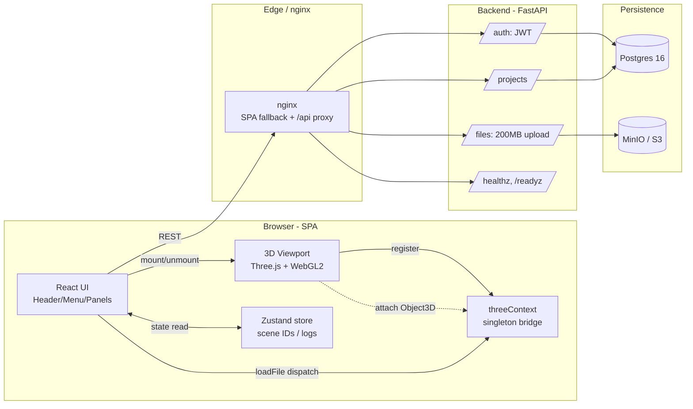
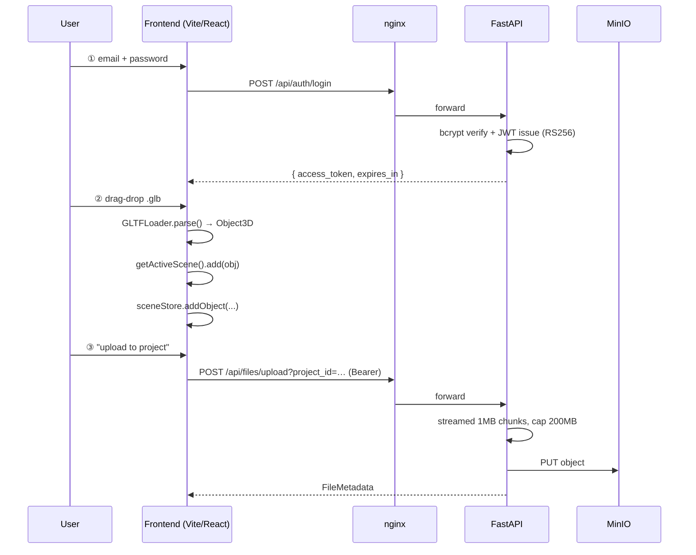
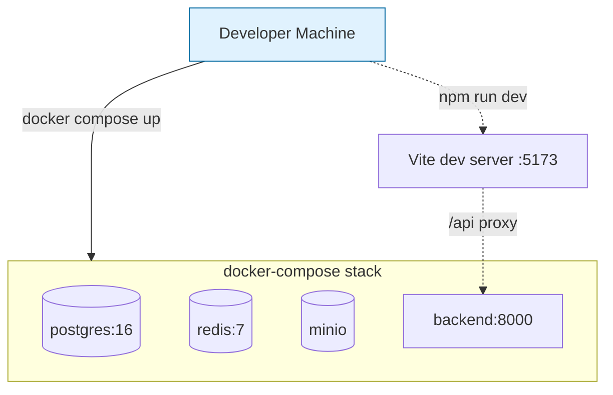

# 🏛️ Architecture — ArcSphere3D

> **Purpose**: 開発者が「どこに何があり、なぜそうなっているか」を 5 分で把握できること。

## 1. レイヤーマップ

## 2. リクエスト・ライフサイクル

## 3. フロントエンド構造

| レイヤー             | 役割                                                       | キーファイル                                       |
| -------------------- | ---------------------------------------------------------- | -------------------------------------------------- |
| `app/layout/`        | 5-pane shell (Header / Menu / Viewport / Panel / Console)  | `AppShell.tsx`                                     |
| `features/viewport/` | Three.js scene 管理・ローダー                              | `useThreeScene.ts`, `loaders.ts`, `FileLoader.tsx` |
| `state/`             | Zustand store (id / name / log のみ — Object3D は持たない) | `sceneStore.ts`                                    |
| `lib/`               | フレーム外接点 (singleton registry)                        | `threeContext.ts`                                  |

**設計原則**:

- **React state に Three.js Object3D を入れない**。renderer/scene は ref + module-singleton で管理し、UI は ID/メタデータのみ持つ。これで StrictMode の double-mount でも漏れない。
- **`useThreeScene` の cleanup で完全 dispose**: renderer, controls, geometries, materials, ResizeObserver, RAF。`initRef` ガードで再初期化抑制。
- **`threeContext` で Three.js ↔ React の境界を明示**。React 側のイベント (file drop) からは `getActiveScene()` 経由でしか scene に触らない。

## 4. バックエンド構造

| レイヤー           | 役割                                                                                |
| ------------------ | ----------------------------------------------------------------------------------- |
| `app/main.py`      | `create_app()`, lifespan, CORS, router 集約                                         |
| `app/config.py`    | Pydantic Settings (env, JWT RS256, DB, S3)                                          |
| `app/security.py`  | bcrypt + JWT (RS256 非対称鍵, JWKS endpoint)                                        |
| `app/schemas.py`   | Pydantic v2 モデル (request / response)                                             |
| `app/deps.py`      | `CurrentUser` DI                                                                    |
| `app/db/`          | SQLAlchemy session, crud, Base                                                      |
| `app/models/`      | Project / File / ProjectMember / User / Alignment                                   |
| `app/s3.py`        | MinIO / S3 wrapper (boto3)                                                          |
| `app/ratelimit.py` | SimpleRateLimiter (login brute-force 防御)                                          |
| `app/routers/`     | health / auth / projects / files / users / alignments / verticals / project_members |
| `tests/`           | pytest + httpx で endpoint 網羅、coverage ≥ 80%                                     |

**現在の制約 (v0.x)**:

- 認証ユーザーは `auth.py` の `_DEMO_USERS` 固定（デモ用）。本番は DB ユーザー + Entra ID SSO へ移行。
- JWT は RS256 非対称鍵。dev/test は ephemeral 鍵で自動フォールバック。本番は KMS で鍵管理。
- File upload は **200 MB ハードキャップ**。大容量は multipart upload への移行が必要 (Issue backlog)。

## 5. デプロイ・トポロジ (MVP)

production は K8s 移行を前提。ADR 0003 (post-MVP) でロードマップ化。

## 6. 観測性 (post-MVP)

- **構造化ログ**: structlog → JSON, k=v。
- **メトリクス**: Prometheus exporter (`/metrics`) を 0.2.x で追加予定。
- **トレース**: OpenTelemetry (OTLP) → Tempo / Jaeger を Month 4 で。

## 7. 関連 ADR

- [0001 — Stack choice (React + FastAPI + Three.js)](./adr/0001-stack-choice.md)
- 0002 (実装済み) — JWT 鍵管理 (RS256 非対称鍵; 本番は KMS へ)
- 0003 (予定) — Production 配置 (compose → K8s)
