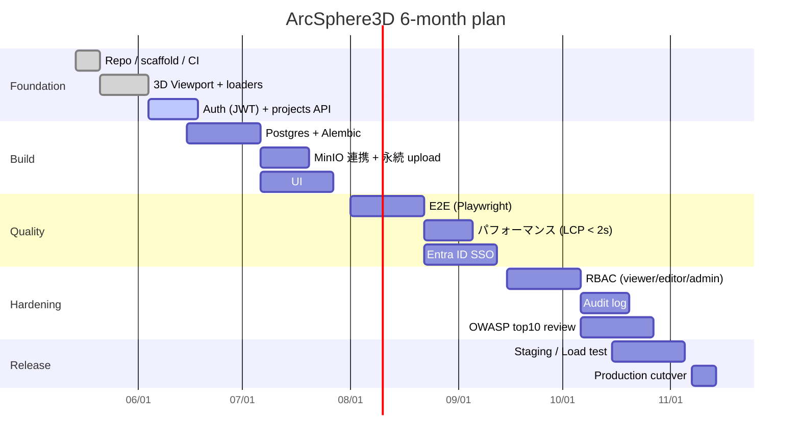

# 🗺️ Roadmap — ArcSphere3D

期間: **2026-05-14 → 2026-11-14** (6 ヶ月厳守)

## マイルストーン

## フェーズ別ゴール

| Month | 主要成果物 | 完了基準 |
|---|---|---|
| **1 (基盤)** | Repo / CI / 3D Viewport / Auth scaffold | `npm run build` + `pytest` が CI で green |
| **2 (機能)** | Postgres + MinIO + プロジェクト永続化 | `docker compose up` でフル E2E が手動で動く |
| **3 (品質)** | Playwright E2E + Entra ID SSO | E2E ≥ 70% 主要パス cover、SSO で社内 demo 可 |
| **4 (堅牢化)** | RBAC + Audit log + 脆弱性 review | RBAC 全 endpoint 検証、CodeQL Critical=0 |
| **5 (検証)** | Staging 完成・負荷試験 | p95 < 500ms @ 50 RPS、エラー率 < 0.5% |
| **6 (本番)** | Production cutover + runbook | 本番稼働 + on-call runbook 完備 |

## リスク登録

| # | リスク | 影響 | 緩和 |
|---|---|---|---|
| R1 | Three.js bundle 増大で LCP 悪化 | 高 | manualChunks + dynamic import + CDN cache |
| R2 | MVP の in-memory が消える前提を本番想定者が忘れる | 中 | README / ARCHITECTURE で明示、起動ログでも警告 |
| R3 | Entra ID 連携の社内 IT スケジュール遅延 | 中 | Month 3 後半に依存、Month 2 末に正式依頼提出 |
| R4 | 大ファイル upload (>200MB) 要件後出し | 中 | resumable upload (TUS) を ADR 0004 で検討 |
| R5 | Postgres 移行時の id (UUID) 整合性 | 低 | 当初から UUID v4 採用、in-memory も同型 |

## 縮退ポリシー (CTO 全権委任ルール)

| 残日数 | 制限 |
|---|---|
| ≤ 30 日 | 新機能は freeze、Improvement → Verify / リリース準備に振替 |
| ≤ 14 日 | 新機能完全禁止、bugfix と stability のみ |
| ≤ 7 日 | リリース準備のみ (CHANGELOG / README / tag / runbook) |
