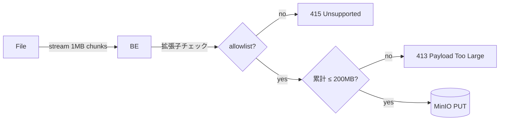

# 🔐 Security — ArcSphere3D

> **方針**: Threat model を最小コストで明示し、MVP のスコープと **production 移行で何を強化するか**を分けて記述する。

## 1. Threat model (簡易)

| Asset               | Threat                            | 現在の対策                                                 | Production 強化                                     |
| ------------------- | --------------------------------- | ---------------------------------------------------------- | --------------------------------------------------- |
| ユーザー credential | brute-force / credential stuffing | bcrypt (cost 12), 401 generic, IP rate limit (5 req/60s)   | CAPTCHA, Entra ID SSO へ移行, DB ユーザー管理       |
| JWT                 | 鍵漏洩で token 偽造               | RS256 非対称鍵, JWKS endpoint, issuer/audience 検証        | 鍵を AWS KMS / Azure Key Vault に移管, key rotation |
| Upload file         | 巨大 / 悪性ファイルで DoS         | 200 MB cap, 拡張子 allowlist, silent success 禁止          | virus scan (clamav), 署名 URL 直 upload             |
| プロジェクト RBAC   | 横断アクセス / IDOR               | owner/editor/viewer 3段階, non-member には 404 (IDOR 防御) | 組織・チーム単位の権限, ファイル単位 ACL            |
| Audit               | 操作ログなし、改ざん              | (未実装 — Issue backlog)                                   | append-only audit log, 90 日保持                    |

## 2. 認証 (現状 v0.x)

- **Algorithm**: RS256 非対称鍵。`JWT_PRIVATE_KEY_PEM` / `JWT_PUBLIC_KEY_PEM` を env 経由で設定。未設定時は dev/test 用 ephemeral keypair を自動生成。
- **JWKS endpoint**: `GET /api/auth/.well-known/jwks.json` で public key を公開 (RFC 7517)。
- **TTL**: access 60 分。refresh は未実装 (再ログインで対応)。
- **Password storage**: bcrypt 4.x 直接 (`passlib` は廃止、ADR 参照)。72-byte cap は事前 truncate で吸収。
- **ユーザー管理**: `auth.py` 内 `_DEMO_USERS` 固定（デモ用）。本番は DB ユーザー + Entra ID SSO が必要。

```python
# app/security.py
def hash_password(plain: str) -> str:
    return bcrypt.hashpw(plain.encode("utf-8")[:72], bcrypt.gensalt()).decode("utf-8")
```

⚠️ **Production 移行時の必須変更**:

- 鍵を AWS KMS / Azure Key Vault に移管し、backend は public key のみ持つ構成へ
- demo ユーザー削除・Entra ID SSO + DB ユーザー管理へ移行
- refresh token + セッション失効機能を実装

## 3. ファイルアップロード



- 拡張子 allowlist: `.stl`, `.obj`, `.gltf`, `.glb`, `.ifc`, `.step`
- Content-Type は **信用しない** (拡張子 + 後段の magic-byte 検査で二重防御 — Month 3 予定)
- 200 MB は memory 保護のための一次防御。永続化に失敗したらそのまま 5xx を返す (silent success させない)

## 4. CORS

`CORS_ORIGINS` env (カンマ区切り) で **明示的な origin** のみ許可。`*` は MVP でも禁止。

```bash
CORS_ORIGINS=http://localhost:5173,https://staging.arcsphere3d.dev
```

## 5. 依存性 / SCA

- **Dependabot** (`.github/dependabot.yml`): npm / pip / actions / docker を週次・月次で監視
- **CodeQL** (`.github/workflows/codeql.yml`): JS/TS + Python を main push と週次で
- **gitleaks** (pre-commit): `.env` / 私鍵 / トークンの誤コミット検出

## 6. レビュー必須ルール (`~/.claude/CLAUDE.md` 連動)

| 変更領域    | 必須レビュー                                                 |
| ----------- | ------------------------------------------------------------ |
| 認証 / 認可 | `/codex:adversarial-review`                                  |
| DB スキーマ | `/codex:adversarial-review`                                  |
| 並列処理    | `/codex:adversarial-review`                                  |
| 全 PR       | `/codex:review` + `/coderabbit:review` の Critical/High 解消 |

## 7. インシデント応答 (post-MVP に骨格化)

1. 検知: nginx access log + Sentry (M3 導入予定)
2. トリアージ: P0 (auth bypass / data leak) → 30 分以内に on-call 招集
3. 緩和: feature flag で新機能 off / DB role を read-only 化
4. 事後: post-mortem within 5 business days, action items を ADR or follow-up issue 化
