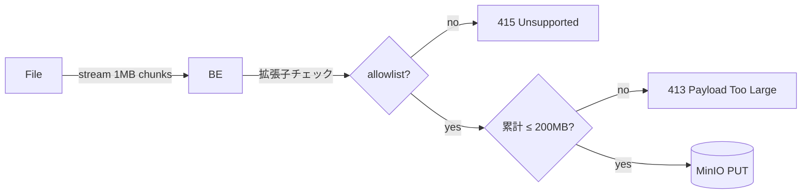

# 🔐 Security — ArcSphere3D

> **方針**: Threat model を最小コストで明示し、MVP のスコープと **production 移行で何を強化するか**を分けて記述する。

## 1. Threat model (簡易)

| Asset | Threat | MVP 対策 | Production 強化 |
|---|---|---|---|
| ユーザー credential | brute-force / credential stuffing | bcrypt (cost 12), 401 generic | rate limit + CAPTCHA, Entra ID SSO へ移行 |
| JWT | secret 漏洩で全 token 偽造可 | HS256 + 環境変数 | RS256 + KMS で公開鍵検証、key rotation |
| Upload file | 巨大 / 悪性ファイルで DoS | 200 MB cap, 拡張子 allowlist | virus scan (clamav), 署名 URL 直 upload |
| プロジェクト RBAC | 横断アクセス | (post-MVP) | viewer / editor / admin、project-scoped permission |
| Audit | 操作ログなし | (post-MVP) | append-only audit log, 90 日保持 |

## 2. 認証 (MVP)

- **Algorithm**: HS256 — ローカル/単一 backend 前提。`JWT_SECRET` は `.env` 経由 (≥ 32 byte ランダム必須)。
- **TTL**: access 60 分。refresh は MVP では未実装 (再ログインで対応)。
- **Password storage**: bcrypt 4.x 直接 (`passlib` は捨てた、ADR 参照)。72-byte cap は事前 truncate で吸収。

```python
# app/security.py
def hash_password(plain: str) -> str:
    return bcrypt.hashpw(plain.encode("utf-8")[:72], bcrypt.gensalt()).decode("utf-8")
```

⚠️ **Production 移行時の必須変更**:
- HS256 → RS256 (鍵を AWS KMS / Azure Key Vault に置き、backend は public key のみ持つ)
- JWT_SECRET を環境変数から外し、Secrets Manager に
- Entra ID で SSO 化、ローカル user store は disable

## 3. ファイルアップロード



- 拡張子 allowlist: `.stl`, `.obj`, `.gltf`, `.glb`, `.ifc`, `.step`
- Content-Type は **信用しない** (拡張子 + 後段の magic-byte 検査で二重防御 — Month 3 予定)
- 200 MB は memory 保護のための一次防御。永続化に失敗したらそのまま 5xx を返す (silent success させない)

## 4. CORS

`CORS_ORIGINS` env (カンマ区切り) で **明示的な origin** のみ許可。`*` は MVP でも禁止。

```bash
CORS_ORIGINS=http://localhost:5173,https://staging.arcsphere3d.dev
```

## 5. 依存性 / SCA

- **Dependabot** (`.github/dependabot.yml`): npm / pip / actions / docker を週次・月次で監視
- **CodeQL** (`.github/workflows/codeql.yml`): JS/TS + Python を main push と週次で
- **gitleaks** (pre-commit): `.env` / 私鍵 / トークンの誤コミット検出

## 6. レビュー必須ルール (`~/.claude/CLAUDE.md` 連動)

| 変更領域 | 必須レビュー |
|---|---|
| 認証 / 認可 | `/codex:adversarial-review` |
| DB スキーマ | `/codex:adversarial-review` |
| 並列処理 | `/codex:adversarial-review` |
| 全 PR | `/codex:review` + `/coderabbit:review` の Critical/High 解消 |

## 7. インシデント応答 (post-MVP に骨格化)

1. 検知: nginx access log + Sentry (M3 導入予定)
2. トリアージ: P0 (auth bypass / data leak) → 30 分以内に on-call 招集
3. 緩和: feature flag で新機能 off / DB role を read-only 化
4. 事後: post-mortem within 5 business days, action items を ADR or follow-up issue 化
